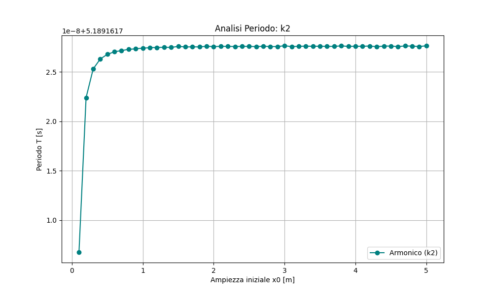
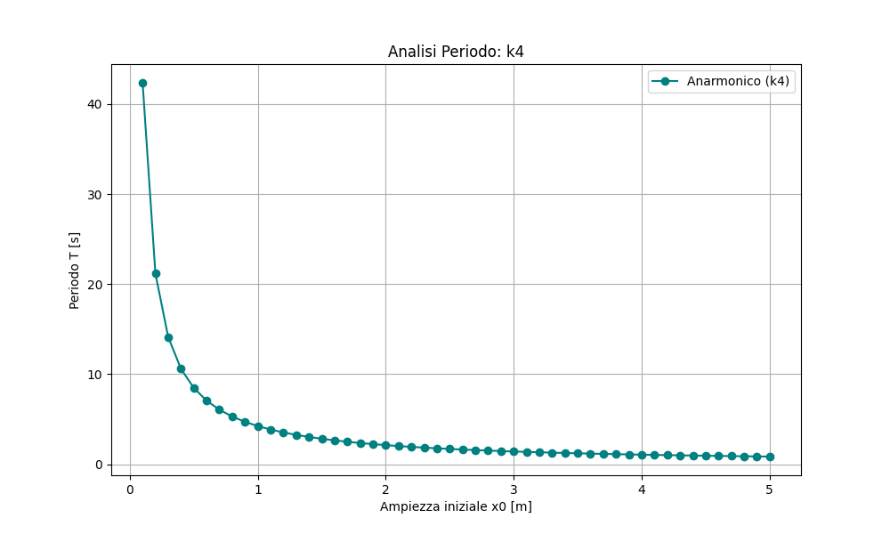
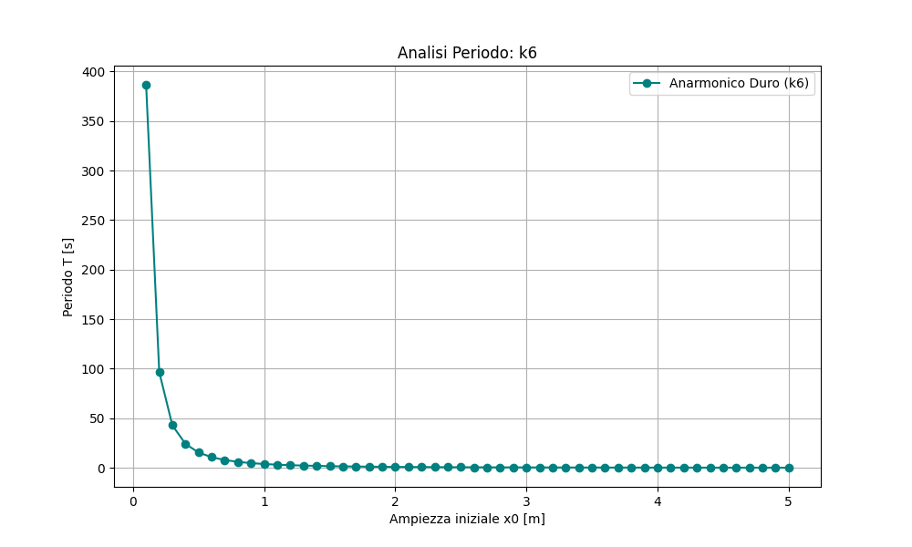
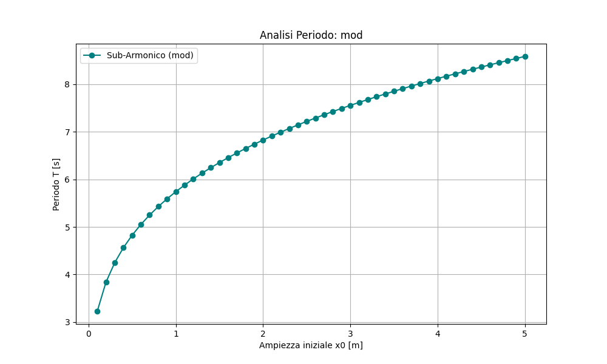
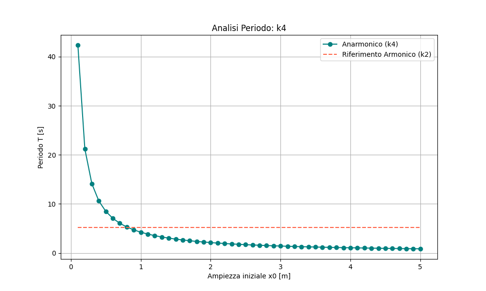
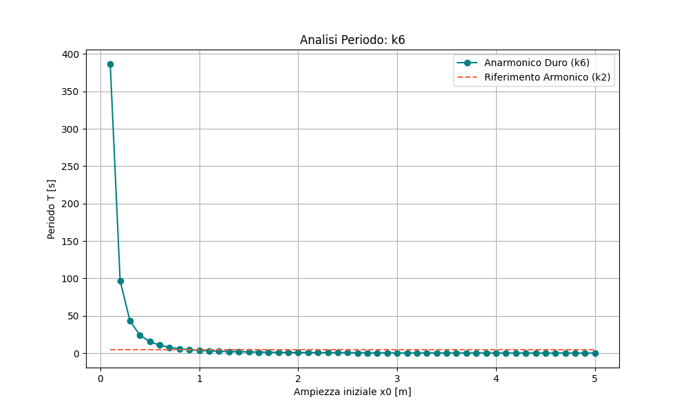
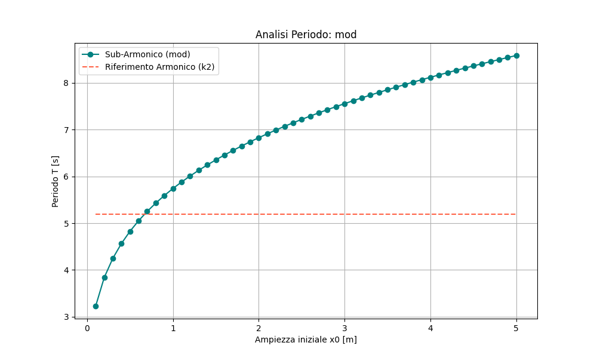

# Simulazione di Oscillatori Armonici e Anarmonici

Questo progetto studia numericamente come il **periodo di oscillazione** dipenda dall’ampiezza iniziale in diversi potenziali non lineari.  
L’obiettivo è confrontare:

- Oscillatore armonico (`k2`)
- Oscillatore anarmonico morbido (`k4`)
- Oscillatore anarmonico duro (`k6`)
- Oscillatore sub-armonico modulato (`mod`)

Sono inclusi anche grafici comparativi fra oscillatori non armonici e quello armonico.

---

## Teoria

Consideriamo un oscillatore unidimensionale con potenziale \( V(x) \).  
L’energia totale dell’oscillatore è:

$$E = V(x_0)$$


dove $x_0$ è l’ampiezza massima.

Il **periodo di oscillazione** è dato da:


$$T = \sqrt{8m}\int_{0}^{x_0} \frac{dx}{\sqrt{V(x_0) - V(x)}}$$


L’integrazione viene eseguita numericamente tramite il metodo di Simpson.

### Potenziali Implementati

####  Oscillatore armonico (k2)

$$V(x) = k x^2$$


####  Anarmonico morbido (k4)

$$V(x) = k x^4$$


####  Anarmonico duro (k6)

$$V(x) = k x^6$$


####  Sub-armonico modulato (mod)

$$V(x) = k |x|^{1.5}$$


---


# Risultati e Trattazione dei Grafici

Di seguito i grafici generati dal programma con la relativa trattazione.  


---

## Oscillatore Armonico



 
Il periodo rimane costante al variare dell’ampiezza. La curva è praticamente orizzontale, come previsto per un potenziale quadratico.

---

## Oscillatore Anarmonico Morbido (k4)




Il periodo aumenta con l’ampiezza. Il potenziale più piatto vicino all’origine rallenta il moto alle grandi ampiezze.

---

## Oscillatore Anarmonico Duro (k6)



 
Il periodo cresce più rapidamente all’aumentare di \(x_0\) a causa della forte crescita del potenziale.

---

## Oscillatore Sub-armonico Modulato (mod)




Il periodo presenta una dipendenza non lineare dall’ampiezza iniziale. Il comportamento è intermedio rispetto ai casi morbido e duro.

---

## Confronto: Armonico vs Anarmonico Morbido




L’anarmonico morbido ha sempre un periodo maggiore dell’armonico. La differenza cresce con l’ampiezza, evidenziando la non linearità.

---

## Confronto: Armonico vs Anarmonico Duro




Per ampiezze elevate l’anarmonico duro supera l’armonico, mostrando la forte influenza del potenziale ripido.

---

## Confronto: Armonico vs Sub-armonico Modulato




La differenza rispetto all’armonico segue un andamento complesso: il comportamento sub-armonico non è monotono e dipende dall’ampiezza.


## Esecuzione

Per lanciare una simulazione: 

```bash
python3 oscillatore.py --potenziale k6
python3 oscillatore.py --potenziale k6 --confronta


